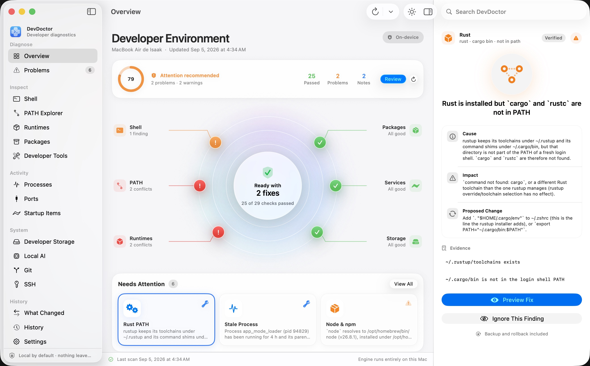

<p align="center"></p>

# DevDoctor

[English](README.md) · Français

Trouvez ce qui a cassé votre environnement de développement.

DevDoctor est un utilitaire open source pour macOS et Windows, en application de bureau et en
ligne de commande, qui analyse votre environnement de développement, explique les problèmes de
configuration, suit les changements et répare en toute sécurité les problèmes courants.

Il répond à la question que tout développeur finit par se poser :

> « J'ai installé un truc hier et maintenant mon terminal est cassé. Qu'est-ce qui a changé ? »



## Ce qu'il fait

- **Shell et PATH** : entrées dupliquées, dossiers disparus, fichiers `source` manquants, boucles
  de `source`, erreurs de syntaxe, entrées inscriptibles par tous, liens de commandes cassés
- **Erreurs au démarrage du terminal** : le `command not found: pyenv` qui s'affiche à chaque
  nouvel onglet est rattaché à la ligne exacte du fichier, avec une réparation sûre et annulable
- **Terminal lent** : `devdoctor startup` mesure le temps de démarrage d'un shell et, pour zsh,
  trace le démarrage ligne par ligne pour nommer les coupables (nvm, compinit, conda…)
- **Suivi d'installation** : `devdoctor run <commande…>` enregistre tout ce qu'un installateur a
  modifié (diff des fichiers de démarrage, PATH, paquets, versions, nouveaux dossiers et
  applications) ; `devdoctor watch` fait la même chose en direct pour les installateurs
  graphiques ; `devdoctor snapshot schedule` prend un snapshot chaque jour via launchd
- **Conflits Python et Node** : `pip` qui installe dans un autre interpréteur que `python3`,
  `npm` qui appartient à un autre Node que `node`, `npm install -g` qui exigerait sudo, paquets
  globaux oubliés dans une ancienne version de Node après un changement nvm/fnm
- **Résolution de commandes** : quel `python`, `node`, `git`, `claude`… s'exécute vraiment, et
  ce qui se cache plus loin dans le PATH
- **Processus et ports**, stockage de développement (caches, `node_modules`, environnements
  virtuels, modèles), IA locale (Ollama, Hugging Face, MLX, LM Studio), Homebrew, Xcode Command
  Line Tools, services au démarrage, SSH, Git
- **Réparations sûres** : aperçu exact, sauvegarde, validation après application, retour
  arrière automatique en cas d'échec, annulation manuelle depuis l'historique
- **Application native macOS** (SwiftUI, macOS 26) : radar de santé, zones système, inspecteur
  cause / impact / changement proposé / preuves, aperçu de réparation avec le diff exact ; une
  application web (Tauri) reste disponible pour macOS 12 à 15
- **Windows (bêta)** : le même moteur lit le PATH dans le registre comme le ferait un nouveau
  terminal, repère les entrées dupliquées ou disparues, les installations Node/Python
  (nvm-windows, fnm, Volta, python.org, pyenv-win, uv, conda, le piège de l'alias Microsoft Store),
  les processus, les ports, les éléments de démarrage, les caches sous `%LOCALAPPDATA%`,
  winget/Scoop/Chocolatey, et planifie les snapshots quotidiens avec le Planificateur de tâches.
  Le PATH Windows n'est pas encore modifié automatiquement ; l'analyse du démarrage du shell ne
  s'applique pas à PowerShell
- **Interface en français, anglais, espagnol et chinois simplifié** : choix Système / English / Français /
  Español / 中文 dans les réglages des deux applications de bureau ; les diagnostics eux-mêmes
  restent en anglais dans cette version
- **Entièrement local** : pas de compte, pas de télémétrie, pas d'accès réseau

## Installation

### Binaires précompilés

```sh
# macOS : ligne de commande dans ~/.local/bin (vérifie le SHA-256 de l'archive)
curl -fsSL https://raw.githubusercontent.com/IsaacPolignac/DevDoctor/main/scripts/install.sh | sh

# macOS : Homebrew
brew tap IsaacPolignac/devdoctor https://github.com/IsaacPolignac/DevDoctor && brew install devdoctor
```

```powershell
# Windows : ligne de commande dans %LOCALAPPDATA%\Programs\DevDoctor (sans droits administrateur)
irm https://raw.githubusercontent.com/IsaacPolignac/DevDoctor/main/scripts/install.ps1 | iex

# Windows : Scoop
scoop install https://raw.githubusercontent.com/IsaacPolignac/DevDoctor/main/scoop/devdoctor.json
```

Les applications de bureau sont sur la page
[Releases](https://github.com/IsaacPolignac/DevDoctor/releases) : app native macOS 26, app web
pour macOS 12 à 15, installateurs Windows (`setup.exe` et `.msi`). Chaque fichier a son `.sha256`.
Les builds ne sont pas encore notarisés ni signés Authenticode : sur macOS, clic droit → Ouvrir la
première fois ; sur Windows, « Informations complémentaires → Exécuter quand même » dans SmartScreen.

### Depuis les sources

Prérequis : Rust (stable) ; Xcode 26 pour l'application native (macOS 26) ; Node 20 ou plus
récent pour l'application web ; sous Windows, les Build Tools de Visual Studio.

```sh
git clone https://github.com/IsaacPolignac/DevDoctor && cd devdoctor

# Ligne de commande
cargo build --release -p devdoctor-cli
./target/release/devdoctor scan

# Application native macOS (macOS 26, Xcode 26) : moteur + app SwiftUI + bundle signé
scripts/build-macos-app.sh --open     # -> target/macos/DevDoctor.app

# Application web (Tauri + React, macOS 12 et plus)
cd apps/desktop && npm install && npm run tauri dev
cd apps/desktop && npm run tauri build
```

## Ligne de commande

```
devdoctor scan [--deep|--storage] [--fail-on <sévérité>] [--json]
devdoctor doctor                     analyse rapide ; code de sortie 2 s'il y a des problèmes
devdoctor issues | issue <id>        problèmes ouverts, détails et aperçu de la réparation
devdoctor fix <id> [--dry-run] [-y]  aperçu puis application d'une réparation
devdoctor fix-safe [--dry-run] [-y]  toutes les réparations réversibles, confirmées et sans risque
devdoctor rollback <tx-id> [-y]      restaure les fichiers modifiés par une réparation
devdoctor run <commande…>            enregistre ce qu'un installateur change
devdoctor watch [--interval 5]       affiche les changements en direct jusqu'à Ctrl-C
devdoctor startup                    temps de démarrage du terminal et lignes lentes
devdoctor path | shell | resolve <commande> | processes | ports | storage | ai | tools
devdoctor snapshot list|create|schedule|unschedule|status | changes [--since 24h]
devdoctor history | report [--markdown] | detectors | completions <shell>
```

Toutes les commandes acceptent `--json`. Codes de sortie : 0 succès, 1 erreur, 2 problèmes
trouvés (`doctor`, `scan --fail-on`), 3 abandon par l'utilisateur.

## Comment fonctionne une réparation

1. Le détecteur note exactement ce qu'il a vu (preuves), pourquoi c'est important et ce qu'il
   recommande.
2. Le fixer calcule un aperçu sans rien toucher : fichiers et lignes modifiés, diff, dossiers
   supprimés, commandes exécutées, risque, réversibilité, espace récupéré.
3. Après confirmation, une transaction démarre : chaque fichier modifié est sauvegardé dans
   `~/Library/Application Support/DevDoctor/backups/<transaction>/`, les changements sont écrits
   de façon atomique puis validés (pour les fichiers shell : `zsh -n`, puis un nouveau login
   shell dont le PATH doit garder les mêmes dossiers dans le même ordre).
4. Si la validation échoue, les sauvegardes sont restaurées automatiquement. Sinon la transaction
   est validée et peut être annulée plus tard avec `devdoctor rollback`.

DevDoctor n'exécute jamais `sudo`, ne modifie jamais de fichiers hors de votre dossier
personnel, ne touche jamais `~/.ssh`, `~/.gnupg` ni les trousseaux, et n'exécute jamais de
chaînes shell construites à partir d'entrées non maîtrisées.

## Langues

Les deux applications de bureau proposent le choix de la langue dans les réglages : **Système**
(suit le système d'exploitation), **English**, **Français**, **Español** ou **中文** (chinois
simplifié). Le choix est enregistré localement ; l'application web se recharge pour l'appliquer.
Les résultats, explications et preuves produits par le moteur de diagnostic (et la sortie de la
ligne de commande) restent en anglais dans cette version.

Les traductions sont centralisées dans `apps/i18n/strings/*.json` (le texte anglais sert de clé),
et `scripts/gen-i18n.py` génère les fichiers `.lproj` Swift et le dictionnaire TypeScript.
`scripts/gen-i18n.py --check` liste les textes d'interface sans traduction ; un texte manquant
s'affiche en anglais.

## Données et confidentialité

Tout reste sur votre Mac : base de données, sauvegardes et journaux vivent dans
`~/Library/Application Support/DevDoctor/` et `~/Library/Logs/DevDoctor/`. Les valeurs de
variables qui ressemblent à des secrets ne sont jamais affichées, journalisées ni stockées ; les
snapshots ne retiennent que les noms de variables. `devdoctor report --markdown` produit un
rapport nettoyé (chemins personnels raccourcis, nom d'utilisateur et e-mails remplacés, secrets
probables masqués) à coller dans un rapport de bug.

## Contribuer

Voir `CONTRIBUTING.md` (en anglais) pour ajouter un détecteur ou un fixer, `docs/ARCHITECTURE.md`
pour la conception et `docs/DECISIONS.md` pour les choix d'architecture. Licence MIT.
