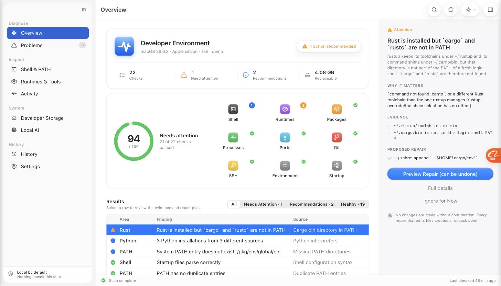
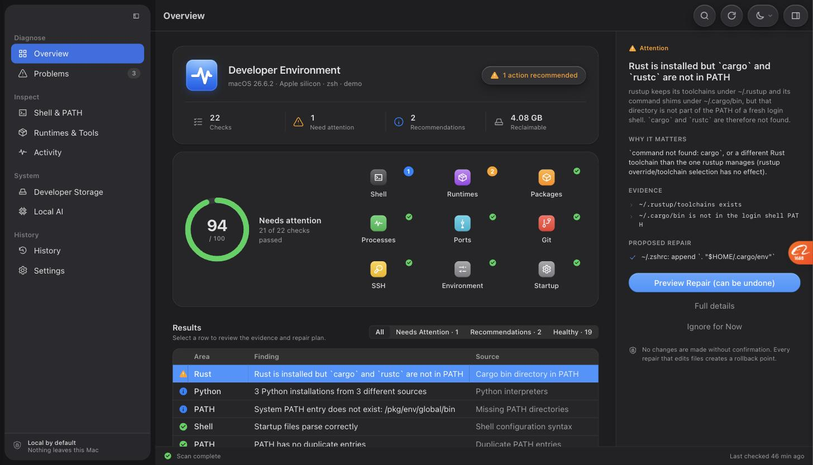

<p align="center"></p>

# DevDoctor

Find what broke your development environment.

DevDoctor is an open-source desktop and CLI utility for macOS that scans your development
environment, explains configuration problems, tracks changes and fixes common issues safely.

It answers the question every developer eventually asks:

> "I installed something yesterday and now my terminal is broken. What changed?"



<details><summary>Dark appearance</summary>



</details>

## Highlights

- Shell and PATH diagnostics: duplicate entries, dead directories, missing `source` targets,
  recursive sourcing, syntax errors, world-writable or empty PATH entries
- Python and Node conflict detection: `pip` installing into a different interpreter than
  `python3`, `npm` belonging to a different Node than `node`, multiple installations
- Command resolution explorer: which `python`, `node`, `git`, `claude`... actually runs, and what
  else is hiding further down PATH
- Process and port inspection with conservative stop actions
- Developer storage scanner: caches, model stores, `node_modules`, virtualenvs, build folders
- Local AI inventory: Ollama models (with removal), Hugging Face, MLX, LM Studio, llama.cpp
- Environment snapshots and "What changed" diffs
- Safe fixes: exact preview, backups, post-fix validation, automatic rollback, manual rollback
- Desktop app (Tauri + React) and CLI sharing one Rust engine
- Native macOS 26 interface: floating translucent sidebar, health ring dashboard with one tile per
  area, results table with a details inspector, "Preview Repair" sheet, Day / Night / System
  appearance and Liquid Glass options; plain-language explanations for beginners with a
  "Technical details" switch for experts
- Fully local: no account, no telemetry, no network access

## Status

Version 0.1 (first vertical slice complete). Implemented and tested end to end:

| Area | What works today |
| --- | --- |
| Scans | Quick, Deep and Storage scans; per-detector timings; detector failures isolated |
| Detectors | 30 real detectors (see `devdoctor detectors`): shell syntax, PATH duplicates/missing/suspicious entries, missing/recursive/duplicate `source`, aliases shadowing commands, environment variables pointing nowhere, Python and Node conflicts, rustup PATH, Homebrew health and `brew doctor`, stale processes, occupied dev ports, caches (Homebrew, npm, pip, uv), Ollama models, broken virtualenvs, stale `node_modules`, brew services, broken launch agents, SSH permissions/config, Git identity |
| Fixers | 14 fixers, all previewed and transactional: remove redundant PATH statements, remove dead PATH directories, disable a `source` line for a missing file, disable duplicated `source` lines, add the rustup/Homebrew initialisation line, restore a startup file from a DevDoctor backup, stop a stale dev process, clear the Homebrew/npm/pip/uv caches, delete a project's `node_modules`, delete a virtual environment, remove an Ollama model |
| Safety | Every fix: preview → backup → apply → validate → commit; automatic rollback when validation fails; manual rollback from history |
| History | Scan history, fix history, environment snapshots, snapshot diffs |
| Desktop | Home with health ring and plain-language issue groups, first-run onboarding, automatic check on launch, one-click "Fix safely" with preview, undo from a toast, Spotlight-style search (⌘K), live check progress, glossary tooltips |
| Platform | macOS (Apple Silicon and Intel). The engine is platform-agnostic; only `devdoctor-platform-macos` talks to the OS |

Not implemented yet (and not pretended): Linux/Windows, plugin SDK, universal install tracking,
`devdoctor run <installer>`, disabling launch agents, cleanup of Hugging Face/MLX models.

## Install and run

Requirements: macOS 12+, Rust (stable), Node 20+ (for the desktop app only).

```sh
git clone <this repository> devdoctor && cd devdoctor

# CLI
cargo build --release -p devdoctor-cli
./target/release/devdoctor scan

# Desktop app (development)
cd apps/desktop && npm install && npm run tauri dev

# Desktop UI in a plain browser with sanitized demo data (design work, no Rust needed)
cd apps/desktop && npm run dev        # then open http://localhost:1420
# refresh the demo fixtures from your own machine: devdoctor demo-export

# Desktop app (bundle)
cd apps/desktop && npm run tauri build
```

## CLI

```
devdoctor scan [--deep|--storage] [--fail-on <severity>] [--json]
devdoctor doctor                     quick scan; exit code 2 when problems exist
devdoctor issues [--all]             open issues
devdoctor issue <id>                 details, evidence and fix preview
devdoctor fix <id> [--dry-run] [-y]  preview then apply one fix
devdoctor fix-safe [--dry-run] [-y]  apply every reversible, confirmed, low-risk fix
devdoctor rollback <tx-id> [-y]      restore the files a fix modified
devdoctor path | shell | resolve <command>
devdoctor processes | ports | stop <pid>
devdoctor storage [--no-projects] | ai | tools | packages | services | git | ssh
devdoctor snapshot list|create [--baseline] | changes [--since baseline|24h|7d]
devdoctor history | report | detectors
```

Every command accepts `--json` for scripting. Exit codes: 0 success, 1 error, 2 problems found
(`doctor`, `scan --fail-on`), 3 aborted by the user.

Issue and transaction ids can be abbreviated to any unique prefix.

## How a fix works

1. The detector records exactly what it saw (evidence), why it matters and what it recommends.
2. The fixer computes a preview without touching anything: files and lines to change, unified
   diff, directories deleted, commands run, risk, reversibility, disk space recovered.
3. On confirmation, a transaction starts: every modified file is backed up under
   `~/Library/Application Support/DevDoctor/backups/<transaction>/`, changes are written
   atomically, then validated (for shell files: `zsh -n`, plus a fresh login shell whose PATH
   must keep the same directories in the same order).
4. If validation fails, the backups are restored automatically and the transaction is marked
   failed. Otherwise it is committed and can be undone later with `devdoctor rollback`.

DevDoctor never runs `sudo`, never modifies files outside your home directory, never touches
`~/.ssh`, `~/.gnupg` or keychains, and never executes shell strings built from untrusted input.

## Repository layout

```
crates/devdoctor-core            engine: models, detector/fixer traits, shell parser, PATH model,
                                 transactions, backups, snapshots, SQLite, inventories
crates/devdoctor-platform-macos  processes (sysinfo), ports (lsof), launchd services, system info
crates/devdoctor-detectors       the detectors
crates/devdoctor-fixers          the fixers
crates/devdoctor                 facade wiring everything; used by both the CLI and the desktop app
crates/devdoctor-cli             the `devdoctor` binary
apps/desktop                     Tauri + React + TypeScript desktop application
fixtures/shell                   startup-file fixtures used by tests
docs/                            architecture and decision records
```

See `docs/ARCHITECTURE.md` for the design and `CONTRIBUTING.md` for how to add a detector.

## Data and privacy

All data stays on your machine:

- database: `~/Library/Application Support/DevDoctor/devdoctor.db`
- backups: `~/Library/Application Support/DevDoctor/backups/`
- logs: `~/Library/Logs/DevDoctor/`

Set `DEVDOCTOR_HOME=<dir>` to use another location (useful for tests).
Environment variable values that look like secrets are never displayed, logged or stored;
snapshots record variable names only. `devdoctor report` produces a sanitized JSON report and
tells you what it contains before you share it.

## License

MIT. See `LICENSE`.
