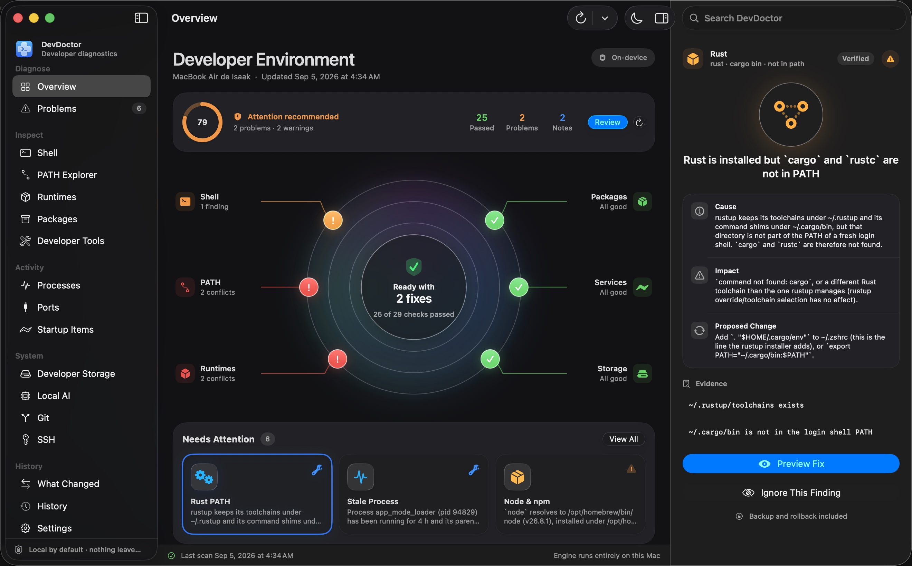
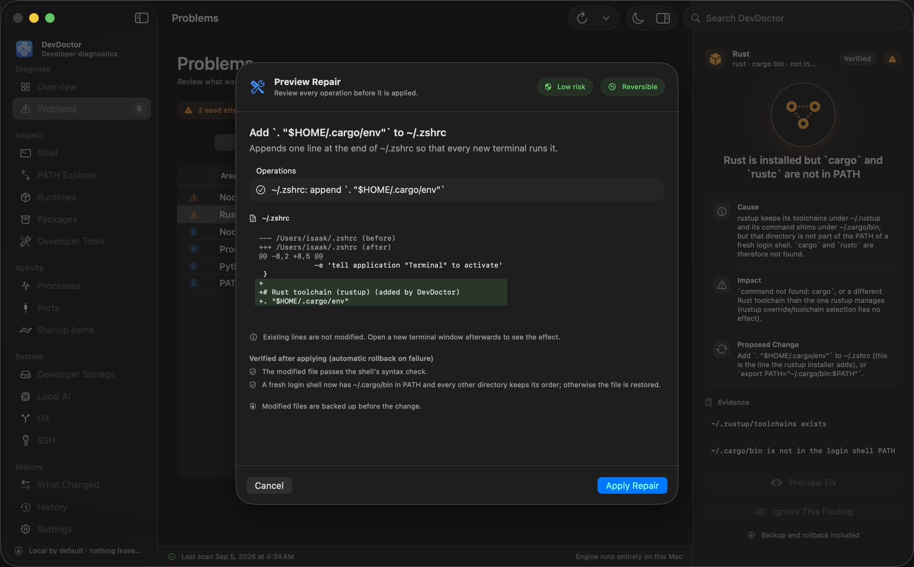

<p align="center"></p>

# DevDoctor

English · [Français](README.fr.md)

Find what broke your development environment.

DevDoctor is an open-source desktop and CLI utility for macOS and Windows that scans your
development environment, explains configuration problems, tracks changes and fixes common
issues safely.

It answers the question every developer eventually asks:

> "I installed something yesterday and now my terminal is broken. What changed?"


<details><summary>Dark appearance and repair preview</summary>





</details>

## Highlights

- Shell and PATH diagnostics: duplicate entries, dead directories, missing `source` targets,
  recursive sourcing, syntax errors, world-writable or empty PATH entries
- Python and Node conflict detection: `pip` installing into a different interpreter than
  `python3`, `npm` belonging to a different Node than `node`, multiple installations
- Command resolution explorer: which `python`, `node`, `git`, `claude`... actually runs, and what
  else is hiding further down PATH
- Process and port inspection with conservative stop actions
- Developer storage scanner: caches, model stores, `node_modules`, virtualenvs, build folders
- Local AI inventory: Ollama models (with removal), Hugging Face, MLX, LM Studio, llama.cpp
- Install tracking: `devdoctor run <installer...>` records what any command changed: startup-file
  diffs, PATH, packages, runtime versions, new folders and applications. Ctrl-C reaches the
  installer, not DevDoctor, so an interrupted install is still recorded
- Terminal startup profiler: how long a new shell takes and which lines of your startup files
  are slow (zsh traced line by line, with advice for nvm, compinit, conda, pyenv, oh-my-zsh...)
- Startup errors traced to the line: the `command not found: pyenv` that every new terminal
  prints becomes an issue with the exact file and line, and a safe, reversible fix
- Xcode Command Line Tools missing or broken, broken command links in PATH, Intel Homebrew
  running under Rosetta on Apple Silicon
- Live watch: `devdoctor watch` prints every change as it happens while you install things in
  another terminal (or with a graphical installer), and saves a summary when you stop it
- Daily snapshots: `devdoctor snapshot schedule` installs a user launch agent (no sudo) so
  "what changed since yesterday" always has a reference point
- npm hygiene: global installs that would need sudo, global packages stranded in an old Node
  version after an nvm/fnm switch, Claude Code installed both natively and through npm
- Environment snapshots and "What changed" diffs
- Safe fixes: exact preview, backups, post-fix validation, automatic rollback, manual rollback
- Native macOS app (SwiftUI, macOS 26) and CLI sharing one Rust engine: health radar, "Needs
  Attention" cards, one tile per system area, an inspector with cause / impact / proposed change /
  evidence, a "Preview Repair" sheet with the exact diff, System / Light / Dark appearance and
  Liquid Glass options; a web-technology app (Tauri + React) remains for macOS 12–15
- Sanitized reports in JSON or Markdown (paste one into a bug report), shell completions
- Windows (beta): the same engine reads PATH from the registry the way a new terminal does,
  finds duplicated and dead entries, Node/Python installations (nvm-windows, fnm, Volta, python.org,
  pyenv-win, uv, conda, the Microsoft Store alias trap), processes, ports, startup entries, caches
  under `%LOCALAPPDATA%`, winget/Scoop/Chocolatey, and schedules daily snapshots with Task Scheduler
- Interface in English, French, Spanish and Simplified Chinese (System / English / Français / Español / 中文 in
  Settings, in both desktop apps); the diagnostics themselves are still written in English
- Fully local: no account, no telemetry, no network access

## Status

Version 0.2. Implemented and tested end to end:

| Area | What works today |
| --- | --- |
| Scans | Quick, Deep and Storage scans; per-detector timings; detector failures isolated |
| Detectors | 37 real detectors (see `devdoctor detectors`): shell syntax, PATH duplicates/missing/suspicious entries, broken command links in PATH, missing/recursive/duplicate `source`, errors printed at terminal startup, slow terminal startup, aliases shadowing commands, environment variables pointing nowhere, Python and Node conflicts, npm global prefix needing sudo, global npm packages stranded in an old Node version, Claude Code installed twice, rustup PATH, Xcode Command Line Tools, Homebrew health (dual prefix, Intel build under Rosetta, broken links) and `brew doctor`, stale processes, occupied dev ports, caches (Homebrew, npm, pip, uv), Ollama models, broken virtualenvs, stale `node_modules`, brew services, broken launch agents, SSH permissions/config, Git identity |
| Fixers | 18 fixers, all previewed and transactional: remove redundant PATH statements, remove dead PATH directories, disable a `source` line for a missing file, disable duplicated `source` lines, disable a startup line whose command is no longer installed anywhere, remove broken command links (undo recreates them), add the rustup/Homebrew initialisation line, restore a startup file from a DevDoctor backup, stop a stale dev process, clear the Homebrew/npm/pip/uv caches, delete a project's `node_modules`, delete a virtual environment, remove an Ollama model, install or remove the daily-snapshot launch agent |
| Tracking | `devdoctor run <command...>`: snapshot before, run the command in the foreground, snapshot after, report the differences (startup-file diffs with secrets redacted, PATH, packages, version changes, new files and apps) and keep the record. `devdoctor watch`: the same, live, for anything you do in the meantime. `devdoctor snapshot schedule`: a daily snapshot through launchd |
| Startup | `devdoctor startup`: median of complete login-shell starts, line-level attribution for zsh (timestamped `xtrace`), advice for known slow tools |
| Safety | Every fix: preview → backup → apply → validate → commit; automatic rollback when validation fails; manual rollback from history |
| History | Scan history, fix history, environment snapshots, snapshot diffs |
| Desktop (native, macOS 26) | `apps/macos`: SwiftUI app driving the same engine through the CLI's JSON. Overview with radar and system areas, Problems with filters, batch "Fix safely" and ignore, inspector, repair preview and result sheets with undo, Shell (with startup profiler), PATH, Runtimes, Packages, Developer Tools, Processes, Ports, Startup Items, Developer Storage (delete after preview), Local AI (remove models after preview), Git, SSH, What Changed (snapshots, baseline, recorded runs), History (scans, repairs, runs), Settings (daily snapshot, Markdown/JSON reports, checks). Live scan progress, ⌘R / ⇧⌘R / ⇧⌘S shortcuts |
| Desktop (web UI, macOS 12+) | `apps/desktop`: the earlier Tauri + React app, kept for older macOS and for the browser demo used in screenshots |
| Reports | `devdoctor report` (JSON) and `devdoctor report --markdown`; both shorten home paths, replace the username and redact likely secrets |
| Platform | macOS (Apple Silicon and Intel): everything above. Windows 10/11 x64 (beta): CLI and the web-technology app; see the platform table below. The engine is platform-agnostic: `devdoctor-core/src/sys.rs` holds the OS primitives and one small adapter crate per OS talks to the system |

Not implemented yet (and not pretended): Linux, plugin SDK, automatic tracking of installs
that were not wrapped in `devdoctor run`, disabling launch agents, cleanup of Hugging Face/MLX
models, line-level startup tracing for bash, editing the Windows PATH (registry) automatically.

### Platforms

| | macOS 12+ | Windows 10/11 (beta) |
| --- | --- | --- |
| Desktop app | Native SwiftUI app (macOS 26) or web-technology app (macOS 12–15) | Web-technology app (Tauri), MSI and per-user installer |
| CLI | `devdoctor` (Apple Silicon and Intel) | `devdoctor.exe` (x64; runs on ARM64 under emulation) |
| PATH | Captured from a fresh login shell; startup files parsed and repaired | Read from the registry (system then user) like a new terminal; duplicates, dead and relative entries reported with instructions; no automatic edit yet |
| Shell startup | Syntax, `source`, aliases, startup errors, profiler (zsh line by line) | Not applicable to PowerShell yet |
| Runtimes | Homebrew, nvm, fnm, Volta, asdf, mise, pyenv, uv, conda, python.org, pip/npm pairing | nodejs.org, nvm-windows, fnm, Volta, python.org, pyenv-win, uv, conda, Store alias, pip/npm pairing |
| Processes and ports | sysinfo + `lsof` | sysinfo + `netstat`; stop with `taskkill` |
| Startup items | launchd agents, brew services | `Run` registry key and Startup folder (read-only) |
| Storage | Homebrew, npm, pnpm, Yarn, pip, uv, Cargo, Docker, Ollama, Hugging Face, MLX, LM Studio, Playwright, Xcode, Gradle/Maven, Go, NuGet, project folders | Same minus Homebrew/Xcode/MLX, with the `%LOCALAPPDATA%` locations |
| Package managers | Homebrew, npm, pnpm, Yarn, pip, pipx, uv, cargo | winget, Scoop, Chocolatey, npm, pnpm, Yarn, pip, pipx, uv, cargo |
| Daily snapshots | User LaunchAgent | Task Scheduler task (current user) |
| Fixes | 18 fixers | Cache clearing, `node_modules`/venv deletion, Ollama models, stale processes, dangling links, snapshot scheduling |

Windows support is built and tested in CI on `windows-latest` (clippy, tests, a real scan, the
Task Scheduler round trip) and cross-compiled from macOS; it has had less time on real developer
PCs than the macOS version, hence "beta". Please report what you see.

## Install and run

### Prebuilt binaries

```sh
# macOS: CLI into ~/.local/bin (verifies the SHA-256 of the release asset)
curl -fsSL https://raw.githubusercontent.com/YOUR_GITHUB_USER/devdoctor/main/scripts/install.sh | sh

# macOS: Homebrew (tap hosted in this repository)
brew tap YOUR_GITHUB_USER/devdoctor https://github.com/YOUR_GITHUB_USER/devdoctor && brew install devdoctor

# Any OS with Rust: build the CLI from the latest tag
cargo install --git https://github.com/YOUR_GITHUB_USER/devdoctor devdoctor-cli
```

```powershell
# Windows: CLI into %LOCALAPPDATA%\Programs\DevDoctor and the user PATH (no administrator rights)
irm https://raw.githubusercontent.com/YOUR_GITHUB_USER/devdoctor/main/scripts/install.ps1 | iex

# Windows: Scoop
scoop install https://raw.githubusercontent.com/YOUR_GITHUB_USER/devdoctor/main/scoop/devdoctor.json
```

Desktop apps are on the [Releases](https://github.com/YOUR_GITHUB_USER/devdoctor/releases) page:
`DevDoctor-<tag>-macos26-arm64.zip` (native app), `DevDoctor-Web-<tag>-macos-arm64.zip`
(macOS 12–15), `DevDoctor-<tag>-windows-x64-setup.exe` / `.msi` (Windows). Every asset has a
`.sha256` next to it. Builds are not notarized or Authenticode-signed yet: on macOS right-click →
Open once, on Windows choose "More info → Run anyway" in SmartScreen.

### From source

Requirements: Rust (stable); Xcode 26 for the native app (macOS 26); Node 20+ for the web-technology app.

```sh
git clone https://github.com/YOUR_GITHUB_USER/devdoctor && cd devdoctor

# CLI
cargo build --release -p devdoctor-cli
./target/release/devdoctor scan

# Native macOS app (macOS 26, Xcode 26): builds the engine, the SwiftUI app and a signed bundle
scripts/build-macos-app.sh --open     # -> target/macos/DevDoctor.app

# Native app during development (uses target/release or target/debug devdoctor automatically)
cd apps/macos && swift run DevDoctor -- --section shell

# Web-technology app (Tauri + React, macOS 12+)
cd apps/desktop && npm install && npm run tauri dev
cd apps/desktop && npm run tauri build

# Web UI in a plain browser with sanitized demo data (design work, no Rust needed)
cd apps/desktop && npm run dev        # then open http://localhost:1420
# refresh the demo fixtures from your own machine: devdoctor demo-export

# Shell completions (zsh shown; bash, fish, elvish and powershell work the same way)
devdoctor completions zsh > ~/.zfunc/_devdoctor   # with fpath+=(~/.zfunc) before compinit
```

```powershell
# Windows, from source (Rust stable + Visual Studio Build Tools; Node 20+ for the app)
cargo build --release -p devdoctor-cli
.\target\release\devdoctor.exe scan
cd apps\desktop; npm install; npm run tauri build      # -> MSI and setup.exe under target\release\bundle
```

## CLI

```
devdoctor scan [--deep|--storage] [--fail-on <severity>] [--json]
devdoctor doctor                     quick scan; exit code 2 when problems exist
devdoctor issues [--all]             open issues
devdoctor issue <id>                 details, evidence and fix preview
devdoctor fix <id> [--dry-run] [-y]  preview then apply one fix
devdoctor fix-safe [--dry-run] [-y]  apply every reversible, confirmed, low-risk fix
devdoctor rollback <tx-id> [-y]      restore the files a fix modified
devdoctor path | shell | resolve <command>
devdoctor processes | ports | stop <pid>
devdoctor storage [--no-projects] | ai | tools | packages | services | git | ssh
devdoctor run <command...>          record what an installer or any command changes
devdoctor watch [--interval 5]       print changes live until Ctrl-C, then save a summary
devdoctor runs [<id>]                recorded runs and their details
devdoctor startup [--samples N]      terminal startup time and the slow lines behind it
devdoctor snapshot list|create [--baseline] | changes [--since baseline|24h|7d]
devdoctor snapshot schedule [--hour 12] | unschedule | status     daily snapshots (launchd / Task Scheduler)
devdoctor runtimes                   Node.js, Python and Rust installations and pairings
devdoctor clean node-modules|venv <path> | ollama-model <name>    previewed, confirmed deletions
devdoctor history | report [--markdown] | detectors | completions <shell>
```

Every command accepts `--json` for scripting. Exit codes: 0 success, 1 error, 2 problems found
(`doctor`, `scan --fail-on`), 3 aborted by the user.

Issue, transaction and run ids can be abbreviated to any unique prefix.

## Track what an installer does

```
$ devdoctor run sh -c "curl -fsSL https://example.com/install.sh | sh"
Recording your environment before running sh -c "curl -fsSL https://example.com/install.sh | sh" ...
  snapshot snap_9f2c... recorded in 1.1 s

[ the installer runs normally, with your terminal, prompts and Ctrl-C ]

Recording your environment after the command ...

What `sh -c "curl -fsSL https://example.com/install.sh | sh"` changed
=====================================================================
exit status: 0   duration: 42 s   run id: run_fb45b1fbfbdc

  • ~/.zshrc modified (+1 / -0 lines)
  • new in ~: .newtool
  • new in ~/.config: newtool

PATH
----
  ~ PATH changed: added ~/.newtool/bin

~/.zshrc (modified)
-------------------
--- ~/.zshrc (before)
+++ ~/.zshrc (after)
@@ -2,2 +2,3 @@
 eval "$(pyenv init -)"
 alias ll="ls -la"
+export PATH="$HOME/.newtool/bin:$PATH"
```

DevDoctor takes a full snapshot before and after (PATH, startup-file hashes, Homebrew, npm,
pipx, uv and cargo packages, Node/Python installations, command resolution with versions,
startup services, listening ports, Ollama models), keeps the text of your startup files to show
exact diffs (secrets redacted before anything is stored), and compares the entry names of the
folders installers like to touch (`~`, `~/.config`, `~/.local/bin`, `~/Library/LaunchAgents`,
`/usr/local/bin`, `/Applications`, `/Library/LaunchAgents`, `/Library/LaunchDaemons`). The
command runs in the foreground with your terminal; the record is kept even if you interrupt it.
`devdoctor runs` lists recorded runs and the desktop "What Changed" page shows them with diffs.

Two companions cover what `run` cannot wrap: `devdoctor watch` polls a quick snapshot every
few seconds and prints each change as it appears (a `.pkg` installer, the App Store, a setup
wizard), then saves the same kind of record when you press Ctrl-C; `devdoctor snapshot
schedule` installs `~/Library/LaunchAgents/dev.devdoctor.snapshot.plist`, a user launch agent
that runs `devdoctor snapshot create` once a day (no sudo, about a second, metadata only), so
`devdoctor changes --since 24h` always has something to compare with. `devdoctor snapshot
status` shows whether it is loaded and when it last ran; `unschedule` removes it. The desktop
Settings page has the same switch.

## Why is my terminal slow?

```
$ devdoctor startup
Terminal startup: 812 ms (slow)
===============================
3 complete zsh start(s): 830, 812, 798 ms — median 812 ms, best 798 ms, worst 830 ms

Slowest startup lines (one traced start: 790 ms, 2 314 lines)
--------------------------------------------------------------
MS   SHARE  WHERE          STATEMENT
512  64%    ~/.zshrc:14    [ -s "$NVM_DIR/nvm.sh" ] && \. "$NVM_DIR/nvm.sh"
161  20%    ~/.zshrc:22    autoload -Uz compinit && compinit
 71   9%    ~/.zshrc:9     eval "$(pyenv init -)"

→ ~/.zshrc:14
  nvm loads slowly by design (300–800 ms is common). fnm is a fast drop-in replacement, or
  nvm can be lazy-loaded from a small `nvm()` wrapper function.
```

Timing starts the same clean login shell DevDoctor uses for every observation. Attribution
runs zsh once with `xtrace` and a `PS4` that stamps each executed line with a microsecond clock,
its file and its line; the time between two consecutive lines is the cost of the first. Lines
of your own startup files get everything they trigger (sourced files, tool initialisations,
completion functions) attributed to them, so the table answers "which line of *my* file is
slow". The trace is parsed in memory and never stored. The quick scan reports a
`shell.startup.slow` issue when a fresh shell takes more than 500 ms, and
`shell.startup.errors` when the shell prints errors while starting.

## How a fix works

1. The detector records exactly what it saw (evidence), why it matters and what it recommends.
2. The fixer computes a preview without touching anything: files and lines to change, unified
   diff, directories deleted, commands run, risk, reversibility, disk space recovered.
3. On confirmation, a transaction starts: every modified file is backed up under
   `~/Library/Application Support/DevDoctor/backups/<transaction>/`, changes are written
   atomically, then validated (for shell files: `zsh -n`, plus a fresh login shell whose PATH
   must keep the same directories in the same order).
4. If validation fails, the backups are restored automatically and the transaction is marked
   failed. Otherwise it is committed and can be undone later with `devdoctor rollback`.

DevDoctor never runs `sudo`, never modifies files outside your home directory, never touches
`~/.ssh`, `~/.gnupg` or keychains, and never executes shell strings built from untrusted input.

## Repository layout

```
crates/devdoctor-core            engine: models, detector/fixer traits, shell parser, PATH model,
                                 transactions, backups, snapshots, SQLite, inventories
crates/devdoctor-platform-macos  processes (sysinfo), ports (lsof), launchd services, system info
crates/devdoctor-platform-windows processes (sysinfo), ports (netstat), Run key / Startup folder, taskkill
crates/devdoctor-detectors       the detectors
crates/devdoctor-fixers          the fixers
crates/devdoctor                 facade wiring everything; used by both the CLI and the desktop app
crates/devdoctor-cli             the `devdoctor` binary (also the API of the native app: `--json`)
apps/macos                       native SwiftUI application for macOS 26 (Swift Package + bundle script)
apps/desktop                     Tauri + React + TypeScript application (macOS 12+, browser demo)
fixtures/shell                   startup-file fixtures used by tests
docs/                            architecture, decision records, release procedure
scripts/                         install.sh / install.ps1, macOS bundle build, formula updater, CI signing helpers
Formula/, scoop/                 Homebrew formula and Scoop manifest for the CLI
.github/                         CI (macOS + Windows), release workflow (macOS + Windows assets), templates
```

See `docs/ARCHITECTURE.md` for the design, `docs/native-design-qa.md` for the native app's design
review, and `CONTRIBUTING.md` for how to add a detector.

## Languages

Both desktop apps let you choose the interface language in Settings: **System** (follows the
OS), **English**, **Français**, **Español** or **中文** (Simplified Chinese). The choice is stored
locally; the web-technology app reloads to apply it. Findings, explanations and evidence produced
by the diagnostic engine (and the CLI output) are in English in this version; translating the
engine's messages is a separate project because they are built from hundreds of format strings.

Translations live in one place, `apps/i18n/strings/*.json` (English text as the key, one entry per
language), and `scripts/gen-i18n.py` generates the Swift `.lproj` files and the TypeScript
dictionary. `scripts/gen-i18n.py --check` lists interface strings that have no translation yet; a
missing translation falls back to English. Adding a language is a matter of adding a column to
those files and one case to `AppLanguage` (Swift) and `LANGUAGES` (TypeScript).

## Data and privacy

All data stays on your machine:

- database: `~/Library/Application Support/DevDoctor/devdoctor.db` (Windows: `%LOCALAPPDATA%\DevDoctor\devdoctor.db`)
- backups: `~/Library/Application Support/DevDoctor/backups/` (Windows: `%LOCALAPPDATA%\DevDoctor\backups\`)
- logs: `~/Library/Logs/DevDoctor/` (Windows: `%LOCALAPPDATA%\DevDoctor\logs\`)

Set `DEVDOCTOR_HOME=<dir>` to use another location (useful for tests).
Environment variable values that look like secrets are never displayed, logged or stored;
snapshots record variable names only. `devdoctor run` stores unified diffs of your startup
files with likely secrets redacted; the startup profiler parses the shell trace in memory and
stores nothing. `devdoctor report` (JSON or `--markdown`) produces a sanitized report and tells
you what it contains before you share it.

## License

MIT. See `LICENSE`.
