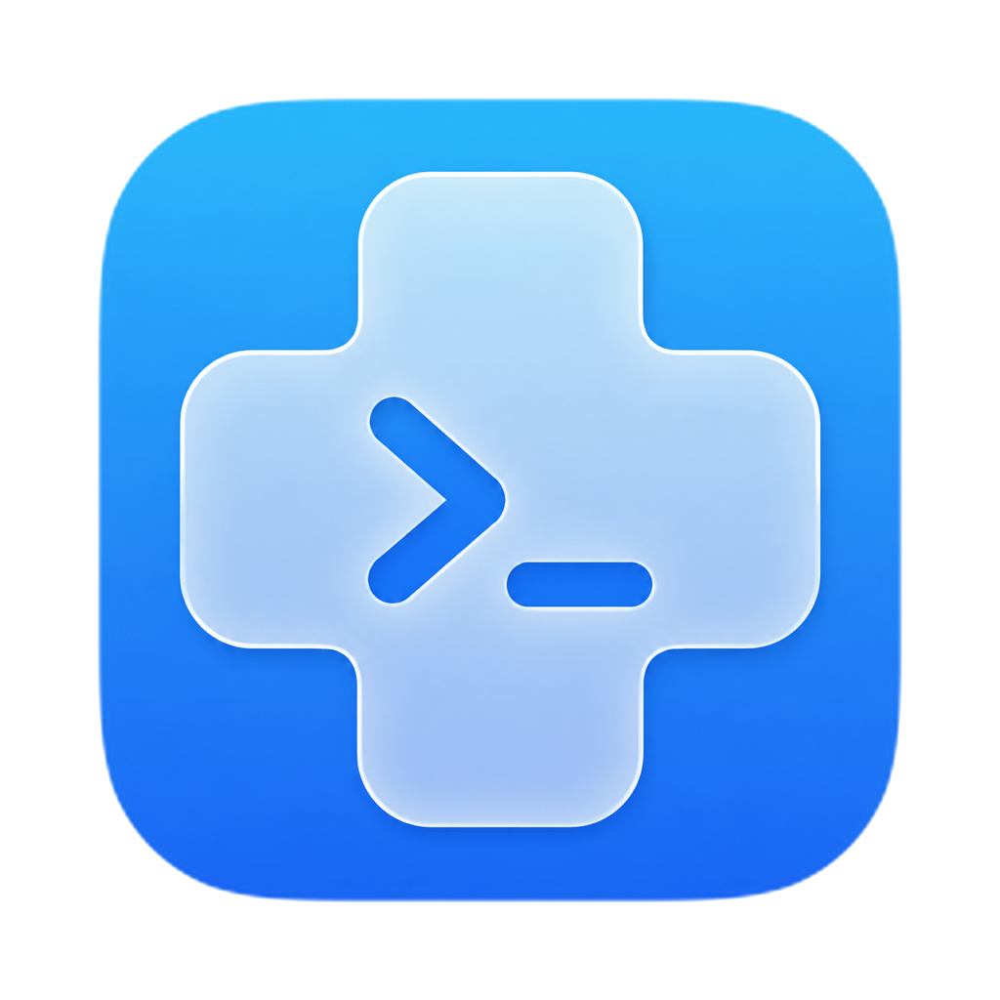
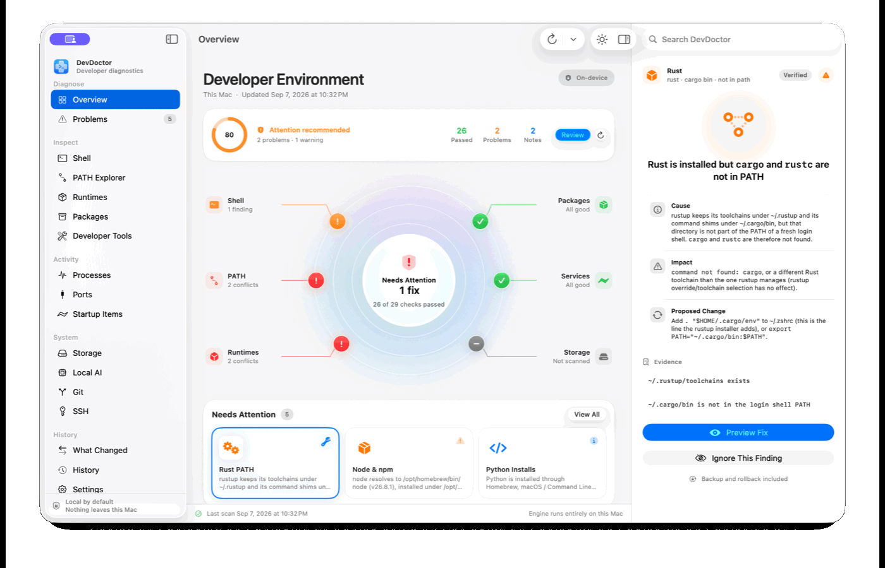
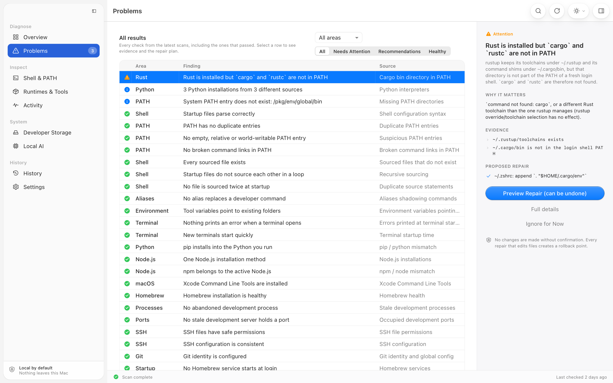
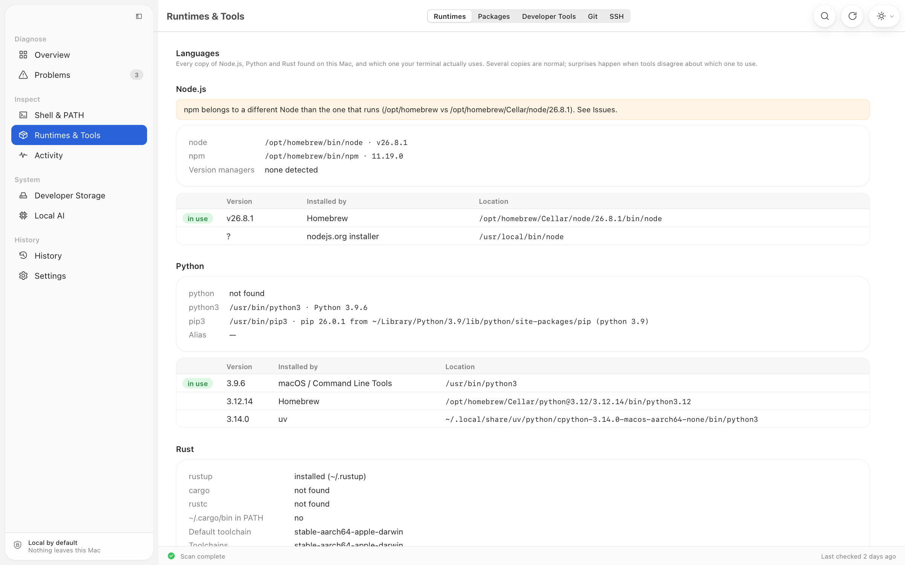
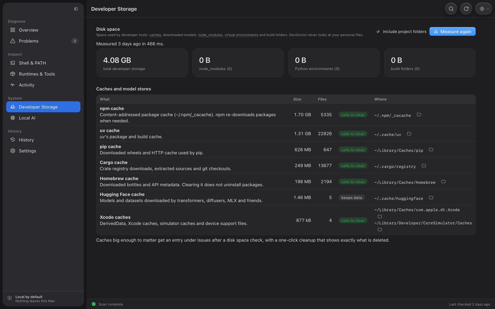

<p align="center"></p>

<h1 align="center">DevDoctor</h1>

<p align="center"><strong>Find what broke your development environment.</strong><br>Diagnose, understand and safely repair local developer tooling on macOS and Windows.</p>

<p align="center">
  <a href="https://github.com/IsaacPolignac/DevDoctor/actions/workflows/ci.yml"></a>
  <a href="https://github.com/IsaacPolignac/DevDoctor/releases/latest"></a>
  <a href="LICENSE"></a>
  
</p>

<p align="center"><a href="#download"><strong>Download</strong></a> · <a href="#install-the-cli">Install the CLI</a> · <a href="README.fr.md">Français</a> · <a href="CONTRIBUTING.md">Contribute</a></p>

## Download

| Your computer | Recommended download |
| --- | --- |
| **Apple silicon · macOS 26+** | **[Download the native Mac app](https://github.com/IsaacPolignac/DevDoctor/releases/download/v0.2.1/DevDoctor-v0.2.1-macos26-arm64.zip)** |
| **Apple silicon · macOS 12–15** | **[Download the compatible Mac app](https://github.com/IsaacPolignac/DevDoctor/releases/download/v0.2.1/DevDoctor-Web-v0.2.1-macos-arm64.zip)** |
| **Windows 10/11 · x64** | **[Download the Windows installer](https://github.com/IsaacPolignac/DevDoctor/releases/download/v0.2.1/DevDoctor-v0.2.1-windows-x64-setup.exe)** |

Intel Mac, MSI and command-line builds are available under [other downloads](https://github.com/IsaacPolignac/DevDoctor/releases/tag/v0.2.1).

## See DevDoctor in action



The walkthrough uses generated demonstration data. It contains no user name, personal path,
project name or private environment information.

DevDoctor gives you one trustworthy view of PATH, runtimes, package managers, processes,
ports, startup items, developer storage and local AI tools. Every finding explains the cause,
impact and proposed change before anything is modified.

## What it catches

| Area | Examples |
| --- | --- |
| Shell & PATH | Duplicate or missing entries, broken links, invalid startup files, recursive or duplicated `source` statements |
| Runtimes | Conflicting Python and Node installations, `pip`/Python or `npm`/Node mismatches, missing rustup PATH |
| Packages & tools | Homebrew health, global npm permission traps, stranded packages, duplicated Claude Code installs |
| Activity | Stale development processes, occupied ports, launch agents and Homebrew services |
| Storage & local AI | Large caches, old `node_modules`, broken virtualenvs, Ollama models and local model stores |
| History | Environment snapshots, recorded installs and a clear “what changed?” timeline |

DevDoctor currently ships 37 detectors and 18 previewed, transactional fixers.

## Designed for safe repairs

```text
detect → explain → preview exact diff → back up → apply → validate
                                                    ↘ rollback on failure
```

- No `sudo`, account or telemetry.
- Repairs never run without a preview and confirmation.
- Modified files are backed up before writing.
- Validation failure triggers an automatic rollback.
- Eligible repairs can be undone later from History.
- Reports shorten home paths and redact usernames, e-mail addresses and likely secrets.

## Native macOS experience

The macOS 26 app is built in SwiftUI and uses the same Rust engine as the CLI. It includes a
health radar, system-area cards, a technical inspector, exact repair previews, System/Light/Dark
appearance and native Liquid Glass controls. The interface is available in English, French,
Spanish and Simplified Chinese; engine-produced diagnostic explanations remain in English.

## Screenshots

<table>
  <tr>
    <td><br><sub><b>Problems</b> — evidence, impact and repair plan together.</sub></td>
    <td><br><sub><b>Runtimes</b> — see which Node.js, Python and Rust installations actually win.</sub></td>
  </tr>
  <tr>
    <td colspan="2"><br><sub><b>Developer Storage</b> — understand reclaimable space before cleaning anything.</sub></td>
  </tr>
</table>

## Platforms

| | Desktop app | CLI | Status |
| --- | --- | --- | --- |
| macOS 26+ | Native SwiftUI, Apple Silicon | Apple Silicon and Intel | Primary platform |
| macOS 12–15 | Tauri app, Apple Silicon | Apple Silicon and Intel | Supported |
| Windows 10/11 | Tauri MSI and per-user installer | x64 | Beta |

Linux is not supported yet. Windows detects PATH issues but does not automatically edit the registry.

## Install the CLI

Every downloadable binary has a neighboring `.sha256` file on the [release page](https://github.com/IsaacPolignac/DevDoctor/releases/tag/v0.2.1).

### macOS CLI

```sh
curl -fsSL https://raw.githubusercontent.com/IsaacPolignac/DevDoctor/main/scripts/install.sh | sh
```

Or with Homebrew:

```sh
brew tap IsaacPolignac/DevDoctor https://github.com/IsaacPolignac/DevDoctor
brew install devdoctor
```

### Windows CLI

```powershell
irm https://raw.githubusercontent.com/IsaacPolignac/DevDoctor/main/scripts/install.ps1 | iex
```

The current application builds are not notarized on macOS or Authenticode-signed on Windows.
See the release notes for first-launch instructions.

## Useful commands

```sh
devdoctor scan                         # quick environment scan
devdoctor scan --deep                  # includes slower checks
devdoctor issue <id>                   # evidence and repair preview
devdoctor fix <id>                     # confirm and apply one fix
devdoctor fix-safe                     # preview confirmed low-risk fixes
devdoctor rollback <transaction-id>    # restore an eligible repair
devdoctor startup                      # profile terminal startup
devdoctor run <command...>             # record what an installer changes
devdoctor watch                        # watch environment changes live
devdoctor snapshot changes --since 24h
devdoctor report --markdown            # sanitized support report
```

Run `devdoctor --help` for the complete command reference. Commands accept `--json` for automation.

## Build from source

Requirements: Rust stable; Xcode 26 for the native app; Node.js 20+ for the Tauri app.

```sh
git clone https://github.com/IsaacPolignac/DevDoctor.git
cd DevDoctor

cargo test --workspace --exclude devdoctor-desktop
cargo build --release -p devdoctor-cli

# Native macOS 26 app
scripts/build-macos-app.sh --open

# Cross-platform Tauri app
cd apps/desktop
npm ci
npm run tauri dev
```

The Rust workspace contains the engine, detectors, fixers, platform adapters and CLI. The native
SwiftUI app and the Tauri app both consume the engine’s JSON output and share the same local
database. See [Architecture](docs/ARCHITECTURE.md) and [engineering decisions](docs/DECISIONS.md).

## Contributing

Bug reports, detector ideas and focused pull requests are welcome. Start with
[CONTRIBUTING.md](CONTRIBUTING.md), follow [SECURITY.md](SECURITY.md) for private vulnerability
reports and read the [Code of Conduct](CODE_OF_CONDUCT.md).

DevDoctor is released under the [MIT License](LICENSE).
