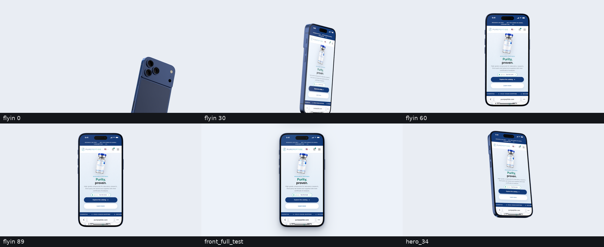

# iPhone (17 Pro, Deep Blue): 3D renders and compositing layers

A procedural, photoreal iPhone 17 Pro built in Blender 5.0 (Cycles CPU). It provides
the phone for the PurePeptide motion film. All paths below are relative to
`assets/iphone/`.



`contact.png`: flyin frames 0 / 30 / 60 / 89, `front_full_test`, `hero_34`. The RGBA tiles are
shown on a light background.

## Files

| file | what it is |
|---|---|
| `tools/build_iphone.py` | Builds `iphone.blend` from nothing in about 2 s: geometry, materials, studio and camera. |
| `tools/render_iphone.py` | Renders every shot and layer, then writes the QC files (`--help` lists the shots). |
| `tools/render_all.sh` | Re-renders everything in order, one Blender at a time (about 25 min). |
| `tools/make_testpattern.py` | Writes `testpattern.png` and `testpattern.json` (patch list used by the colour round-trip check). |
| `iphone.blend` | The scene. All phone parts are children of the empty `iPhone`. Shots move only that empty; the camera and lights never move. |
| `front_body.png` | 3840x2160 RGBA. Body, frame, black border, glass edge and Dynamic Island (opaque). The **screen area is a holdout (alpha 0)**. |
| `front_glass.png` | 3840x2160 RGBA. Reflections on the cover glass over the screen only: a soft diagonal sheen at the top, peak 12.9 % (0.129 sRGB). Use normal blend. |
| `front_glass_screen.png` | The same reflections as RGB on black, for `mix-blend-mode: screen`. Use either this file or `front_glass.png`, not both. |
| `front_shadow.png` | 3840x2160 RGBA. Soft drop shadow in navy-black for a light background: three layers (contact, key, ambient), synthesised from the silhouette. |
| `screen_rect.json` | The screen opening and the Dynamic Island in px, at 3840x2160 and 1920x1080, plus the alpha verification. |
| `front_full_test.png` | 1920x1080 QC composite: background, shadow, `screen_home.png`, body, glass. |
| `renders/flyin/0000-0089.png` | Fly-in, 90 frames at 30 fps, 1920x1080 RGBA, with motion blur. **Frame 89 is the front pose.** Its screen is the old `screen_home.png` (uncleaned lede): **not allowed in the film** (BRIEF §10). |
| `renders/flyin_blank/0000-0089.png` | The same fly-in with `../site/clean/screen_blank.png` (status bar + Safari bar + home hero background, no page content). Source of `flyin_land.webm`. |
| `renders/flyin_land/0000-0067.png` | The 68-frame retime of `flyin_blank` (see below). |
| `flyin_land.webm` | **The film's fly-in** (S06 `v-flyin`, f682–f749): 68 frames, VP9 + alpha, crf 18. Last frame = REST front pose with the blank screen. |
| `renders/tiltout/0000-0044.png` | Tilt-out, 45 frames at 30 fps, 1920x1080 RGBA. **Frame 0 is the front pose.** The screen shows `screen_cart.png`. |
| `hero_34.png` | 1920x1080 RGBA 3/4 hero still (the last pose of the tilt-out). |
| `back.png` | 1920x1080 RGBA back 3/4 still (QC). |
| `renders/front3d.png` | The front pose rendered fully in 3D at 1080p (QC). It is identical in pose to flyin frame 89. |
| `renders/colortest*.png`, `renders/cutcheck_diff_x8.png` | QC outputs (see Verification). |

## Compositing the front pose in HyperFrames

The phone is centred. Its height is 1800 px at 3840x2160, or 900 px at 1080p. The layers are
rendered at 2x, so they stay crisp up to a 2x zoom. Stack them from bottom to top:

1. `front_shadow.png`
2. the screen content: HTML or video, placed in the `screen` rect with `border-radius: radius`
3. `front_body.png` (its hole reveals the content; the Dynamic Island sits on top of it)
4. `front_glass.png` (normal blend), or `front_glass_screen.png` with `mix-blend-mode: screen`

Scale all layers together. They share the same 3840x2160 canvas.

### screen_rect (top-left origin, px)

| | x | y | w | h | radius |
|---|---|---|---|---|---|
| screen @1920x1080 | 759.85 | 105.27 | 400.31 | 869.45 | 51.9 |
| island @1920x1080 | 897.81 | 119.19 | 124.39 | 36.82 | 18.41 |
| screen @3840x2160 | 1519.69 | 210.55 | 800.61 | 1738.91 | 103.8 |
| island @3840x2160 | 1795.61 | 238.38 | 248.78 | 73.64 | 36.82 |

Phone silhouette bounding box: 741.5, 90, 437 x 900 at 1080p (1483, 180, 874 x 1800 at 4K).

- The rect is the projection of the display corners (`bpy_extras.object_utils.world_to_camera_view`).
  It was checked against the alpha of `front_body.png`: the hole edges, measured at alpha = 0.5,
  are within **0.14 px** of the projection. The island centre is opaque (alpha 1).
- The hole's corners are superellipse curves (continuous curvature), not circular arcs.
  `radius` is the circle-equivalent CSS radius. A rounded rect with this radius fully covers the
  hole (gap 0 px), so it is safe as `border-radius` for content placed under the body. The few
  corner pixels that poke out are hidden by the opaque black border.
- The screen texture is 1206x2622 px (402x874 pt at 3x). The rect has exactly that aspect ratio.

### The 3D-to-2D cut

The fly-in ends, and the tilt-out starts, on the identity transform, which matches the layers
exactly. The cover glass is set to 100 % transmission plus reflection, so in the 3D frames the
screen keeps its exact PNG colours, the same as the HTML content. Measured with
`render_iphone.py cutcheck`, flyin frame 89 against the 2D stack (content + body + glass):
the mean difference over the phone is **2.7 levels** (out of 255). Over the screen below the status bar it is 2.1 levels mean and 25 levels at the 99th percentile, and those outliers sit only on text edges. Registration is exact: the measured sub-pixel shift is 0.0 px.
The residual differences come from the texture filter on text edges (Cycles pixel filter against
Lanczos) and from the sheen blend: Cycles adds it in linear light, CSS `screen` blends in sRGB.
Neither is visible at playback speed.

## Re-rendering with another screen texture

```bash
PY=/home/user/DevDoctor/ads/purepeptide-blender/.venv/bin/python
cd assets/iphone
$PY tools/render_iphone.py flyin   --screen ../site/screen_home.png        # 90 frames
$PY tools/render_iphone.py tiltout --screen ../site/screen_cart.png        # 45 frames
$PY tools/render_iphone.py hero_34 --screen ../site/screen_product.png
$PY tools/render_iphone.py front   --screen ../site/screen_home.png        # layers do not depend on it; only front_full_test does
$PY tools/render_iphone.py flyin --frames 60-89 --pct 50 --samples 6       # quick preview of part of a shot
tools/render_all.sh                                                         # everything, sequentially
```

- Without `--screen`, the shots use `../site/screen_home.png` (the tilt-out uses `screen_cart.png`).
  If those files are missing, they fall back to `testpattern.png`.
- Any sRGB PNG of 1206x2622 works. It is shown as emission at strength 1 through the Standard view
  transform, so pixels round-trip exactly.
- Options: `--frames a-b` (0-based, also `0,30,60`), `--pct N`, `--samples N`, `--no-mblur`,
  `--out DIR`. Run only one Blender render at a time.

## Render settings and measured cost

- Cycles CPU with 4 threads, 1920x1080, **12 samples** with adaptive sampling (0.02), OIDN
  (prefilter Accurate, quality Balanced), 8 bounces (diffuse 2, glossy 4, transparency 12),
  caustics off, indirect clamp 4, pixel filter 1.0 px, Standard view transform.
- Motion blur on the sequences (shutter 0.5). The phone empty is keyframed on every frame with
  linear interpolation.
- Each frame renders only the phone's projected bounding box (`use_border`), including the
  motion-blur span. This cuts tracing and denoising time.
- **Measured: 7.14 s/frame on average for the fly-in (90 frames, 643 s), 7.81 s/frame for the tilt-out (45 frames, 352 s).**
  Front layers at 4K: body 18 s, glass 27 s (32 samples).

## The model (mm, real proportions)

- 150.0 x 71.9 x 8.75 mm. The outline uses superellipse corners (n = 3, 16 mm extent, about 11.3 mm
  circle-equivalent) with curvature-continuous joins.
- Flat aluminium sides with a 0.9 mm front rim radius and a 1.1 mm back rim radius.
- Cover glass flush with the frame, with a 2.5D curved edge. Black border 1.63 mm, so the display
  inset is 2.63 mm. The display is 66.6 x 144.7 mm with concentric squircle corners.
- Dynamic Island: 20.7 x 6.1 mm (125 x 37 pt), 2.3 mm (14 pt) below the top edge of the display.
  This is the real iOS 17 Pro geometry, chosen so that the status bar in the captured screens
  (time and icons) lines up with the island. The brief suggested about 3.5 mm. The pill contains a
  faint front-camera lens.
- Left side: Action button, volume up, volume down. Right side: side button and Camera Control, a
  flush sapphire button with a dark gap ring. All buttons are bevelled pills that stand 0.6 mm
  proud.
- Antenna bands (dark resin) on the sides, top and bottom. Bottom: USB-C port, speaker and mic
  holes, screws. Earpiece slit at the top of the glass.
- Back: a full-width camera plateau, 1.7 mm high and 43 mm tall, flush with the side rails and with
  a rounded edge. Three lens housings in the device colour, each with a black barrel with grooves,
  a steel ring, an AR-coated element (thin film) and a sapphire cover. Flash, LiDAR and mic hole.
  A matte, colour-matched glass panel sits below the plateau.
- **There is no Apple logo and no text on the device.**
- Deep Blue anodised aluminium: navy metal (F0 `#33466E`) with a silver-blue edge tint and a
  thin clear anodic coat. The roughness is about 0.3 with a faint variation.
- Studio: area key, fill and back lights; gradient strip softboxes (left, right, top) for the long
  highlights on the sides; side strips at 90 degrees, which draw the bright line on the front rim
  radius; thin kickers behind the phone. A gradient "sheen card" is seen only in reflections and
  produces the glass sheen. Light-linking flags keep the front fills off the cover glass and keep
  the broad sources off the camera covers.

## Verification

- Colour round trip (`render_iphone.py colortest`): with the glass hidden, the 24 test-pattern
  patches come back within **0.77 levels max** (0.20 mean). With the glass on, the only difference
  is the intended sheen, up to 13 levels near the top-left.
- Screen rect against the alpha of `front_body.png`: 0.14 px max error. The phone height is exactly
  1800 px at 4K, and it is centred at (1920, 1080).

## Limitations

- The Standard view transform is required for exact screen colours, so metal highlights clip hard
  instead of rolling off as they would with a filmic transform. The lights were tuned to keep this
  limited to thin specular lines.
- Fly-in frames 19 to 21: the phone is edge-on and the cover glass, at a grazing angle, mirrors the
  left softbox. This shows as a short white glint across the glass. It is physically plausible and
  lasts 3 frames.
- The model is built from public photos and dimensions, not CAD. It is accurate in proportions and
  layout, but details such as the lens-housing sizes and the exact flash and LiDAR positions are
  approximations.
- The Dynamic Island follows iOS (2.3 mm from the top of the display) rather than the brief's
  approximate 3.5 mm, so that it lines up with the status bar of the captured screens.
- There are no shadows in the 3D sequences; the compositor adds them. `front_shadow.png` applies to
  the front pose only.
- The renders use the site captures `screen_home.png` and `screen_cart.png` dated 2026-10-06 23:18.
  If they change, re-run the commands above.

## In HyperFrames
The PNG sequences (`renders/flyin/`, `renders/tiltout/`, not in git — re-render with `tools/render_all.sh`) are
encoded to VP9 with alpha for the film:
```bash
ffmpeg -framerate 30 -i renders/flyin/%04d.png -c:v libvpx-vp9 -pix_fmt yuva420p -b:v 0 -crf 18 -row-mt 1 -auto-alt-ref 0 flyin.webm
ffmpeg -framerate 30 -i renders/tiltout/%04d.png -c:v libvpx-vp9 -pix_fmt yuva420p -b:v 0 -crf 18 -row-mt 1 -auto-alt-ref 0 tiltout.webm
```
`<video src="assets/iphone/flyin.webm" ...>` keeps its transparency in `npx hyperframes render` (tested over a gradient).

## The film's fly-in: `flyin_land.webm` (P0-B, 2026-10-07)

```bash
PY=/home/user/DevDoctor/ads/purepeptide-blender/.venv/bin/python
cd assets/iphone
$PY tools/render_iphone.py flyin --screen $PWD/../site/clean/screen_blank.png --out $PWD/renders/flyin_blank   # 90 f, 524 s (5.82 s/frame)
# retime 90 -> 68 frames: output n <- source 2n (n = 0..21), then source n+22 (n = 22..67); uniform steps, no judder
mkdir -p renders/flyin_land
for n in $(seq 0 67); do s=$([ $n -le 21 ] && echo $((2*n)) || echo $((n+22))); cp renders/flyin_blank/$(printf %04d $s).png renders/flyin_land/$(printf %04d $n).png; done
ffmpeg -framerate 30 -i renders/flyin_land/%04d.png -c:v libvpx-vp9 -pix_fmt yuva420p -b:v 0 -crf 18 -row-mt 1 -auto-alt-ref 0 flyin_land.webm
```

- Output: 1920x1080, 30 fps, 68 frames, `alpha_mode=1`, 1.05 MB. Decoded alpha spans 0–255 on every frame.
- Timing in the film (start f682): source frames 0–42 play at double speed (output 0–21), then 44–89 at 1:1 (output 22–67).
  The edge-on frame (source 20) lands on output 10 = **f692**. Because the first part is played at 2x, the glass glint
  (source 19–21) now shows on a single output frame (10); it was 3 frames at 1:1.
- Checked by eye at output 0 / 20 / 40 / 67: 0 is the back (camera plateau, no logo) entering from the lower right; 20 is a
  3/4 front with the lit blank screen; 40 is nearly settled; 67 is the REST front pose.
- **QC of the cut (f749 → f750):** source frame 89 composited over the PAPER world + `front_shadow.png`, against a browser
  snapshot of the real 2D rig (`js/phone.js`, `.ps` showing `blank`, REST) at f750:
  phone region mean **2.09 levels** (p99 31.7, only on the rim/border edges), screen below the status bar mean 1.32
  (p99 18); with the decoded webm's last frame instead of the PNG: mean **2.47**. Both pass the < 3 levels target.
